***********************
Manuel de l'utilisateur
***********************

    « Le couteau-suisse du prof de maths. »

*Copyright © 2005-2013 Nicolas Pourcelot*

Informations complémentaires : http://wxgeo.free.fr__

.. __: http://wxgeo.free.fr

.. contents:: **Sommaire :**

=======
Licence
=======

Géophar, anciennement nommé WxGéométrie, est un **logiciel libre** : vous êtes encouragés à le partager autour de vous, ou même le modifier, selon les termes de la licence ci-dessous (GNU Public License version 2).

*This program is free software; you can redistribute it and/or modify it under
the terms of the GNU General Public License as published by the Free Software
Foundation; either version 2 of the License, or (at your option) any later
version.
This program is distributed in the hope that it will be useful, but WITHOUT
ANY WARRANTY; without even the implied warranty of MERCHANTABILITY or FITNESS
FOR A PARTICULAR PURPOSE. See the GNU General Public License for more
details.
You should have received a copy of the GNU General Public License along with
this program; if not, write to the Free Software Foundation, Inc., 51
Franklin St, Fifth Floor, Boston, MA 02110-1301*

*Ce programme est un logiciel libre; vous pouvez le redistribuer et/ou le
modifier selon les termes de la GNU General Public Licence telle qu'elle a
été publiée par la Free Software Foundation; soit la version 2 de la licence,
ou (au choix) toute version ultérieure.
Ce programme est distribué dans l'espoir qu'il puisse être utile, mais sans
aucune garantie, pas même la garantie implicite qu'il puisse etre adapté à un
usage donné. Pour plus de précisions, lisez la GNU General Public License.
Vous avez recu en principe une copie de la GNU General Public License en même
temps que ce programme. Si ce n'est pas le cas, écrivez a l'adresse suivante
: Free Software Foundation, Inc., 51 Franklin St, Fifth Floor, Boston, MA
02110-1301*

============
Installation
============

Pour fonctionner, ce programme nécessite la configuration logicielle suivante:

-   Windows XP ou supérieur, ou une distribution Linux récente.

    *L'installation sous MacOs X est possible mais un peu  technique semble-t-il*.

-   Les logiciels suivants, tous libres et gratuits:

    + le logiciel Python__, version 2.6 ou supérieure.

    .. __: http://www.python.org

    *Sous Linux, une version récente est en principe déjà présente*.

    +   La librairie graphique PyQt__, version 4.6 ou supérieure.

    .. __: http://www.riverbankcomputing.co.uk/software/pyqt/download

    + La librairie mathématique numpy__

    .. __: http://sourceforge.net/projects/numpy/

    +   La librairie mathématique Matplotlib__, version 1.0 ou supérieure

    .. __: http://www.sourceforge.net/projects/matplotlib

*Remarque* : ces logiciels doivent être installés dans l'ordre mentionné.

Sous Windows, un redémarrage du système est conseillé après ces installations.

Après avoir téléchargé la dernière version de Géophar__, dézippez l'archive dans
un répertoire sur lequel vous avez les permissions nécessaires.
Vous pouvez lancer le programme en double-cliquant sur le fichier *wxgeometrie.pyw* .

.. __: http://www.sourceforge.net/projects/geophar

*Sous Windows :*

La version conseillée est désormais la version **sans installation**,
qui ne nécessite **pas** d'avoir installé Python ni les logiciels précédemment mentionnés.

Il suffit de récupérer un fichier archive, qui va s'extraire automatiquement en double-cliquant dessus.

Cette version peut fonctionner facilement sur une simple clé USB, ou sur un ordinateur
sur lequel on n'a pas la permission d'installer des programmes.

==================================
Description des différents modules
==================================

Géophar est composée de plusieurs modules ; il contient entre autres les modules suivant :

-   Un module de géométrie dynamique.
-   Un traceur de courbes.
-   Une calculatrice formelle.
-   Un module graphique de statistiques.
-   Un générateur d'arbres de probabilités.
-   Un générateur

Les autres modules présents sont fournis à titre expérimental, et ne sont donc pas documentés ici.

*Note :*
Toutes les fonctionnalités du module de géométrie dynamique sont utilisables
dans le traceur de courbes ; elles sont aussi (en partie) utilisables dans le
module de statistiques.

Le module de géométrie dynamique
================================

Pilotage avec la souris
-----------------------

Vous pouvez pour l'instant faire les actions suivantes :

-   créer une nouvelle feuille
-   créer différents types de points, de droites, de cercles, des
    vecteurs, des intersections...
-   modifier les propriétés de ces différents objets (changer leur
    couleur, les masquer...)
-   régler la fenêtre d'affichage
-   orthonormaliser le repère
-   annuler une ou plusieurs actions
-   exporter et sauvegarder la figure

Utilisation de la souris pour piloter le logiciel :

-   Laissez enfoncé le *bouton droit* de la souris pour *déplacer la figure*.
-   La *molette* de la souris permet de *zoomer* sur la figure.
-   En laissant enfoncée la touche [Ctrl], la molette de la souris permet
    d'ajuster la taille des textes de la figure.
-   Laissez enfoncée la touche [Ctrl], et le bouton gauche de la souris,
    pour sélectionner une zone et zoomer dessus.
-   Vous pouvez déplacer les points libres de la figure avec la souris.
-   Placez-vous sur un point, ou un texte, et appuyez sur la touche
    [Entrée], pour le renommer.
-   Placez-vous sur un objet, et faites un clic droit pour éditer ses
    propriétés
-   Placez-vous sur un objet, et faites [Suppr] pour le supprimer, ou
    [Maj] + [Suppr] pour le masquer .
-   Si vous créez un point libre en laissant la touche [Maj] enfoncée, le
    point se placera sur le quadrillage.
-   Vous pouvez *déplacer le nom d'un point* autour de celui-ci en cliquant
    dessus, la touche [Alt] étant enfoncée.
    Vous pouvez également utiliser la touche [Win] (dite aussi touche [Super]).

.. warning::

    Sous *Ubuntu*, la touche [Alt] est déjà utilisée pour déplacer la fenêtre.
    Il est conseillé d'utiliser à la place la touche [Win].
    On peut aussi modifier ce comportement (dans Système>Préférence>Fenêtres,
    choisir par exemple "Super" comme "touche de mouvement").

Création d'objets via le menu «Créer»
-------------------------------------

Pour la création des objets géométriques, il existe une abondante aide
contextuelle dans chaque fenêtre de création d'objet.

Cliquez sur le point d'interrogation en haut de la fenêtre, puis sur un
champ, pour obtenir une aide détaillée.

En cliquant avec le bouton du milieu de la souris dans un champ, vous ferez
également apparaitre diverses propositions.

Vous pouvez utiliser les notations suivantes : ``[A B]`` pour le segment [AB],
``(A B)`` pour la droite (AB), ``A->B`` pour le vecteur
:math:`\overrightarrow{AB}`, ``||A->B||`` pour sa norme.

.. note:: Remarquez l'espace entre les lettres « A » et « B » dans les deux premiers cas.

Choisir le mode d'affichage de l'étiquette d'un objet
-----------------------------------------------------

Vous remarquerez que chaque objet possède quatre modes d'affichage : nom,
texte, formule, ou aucun.

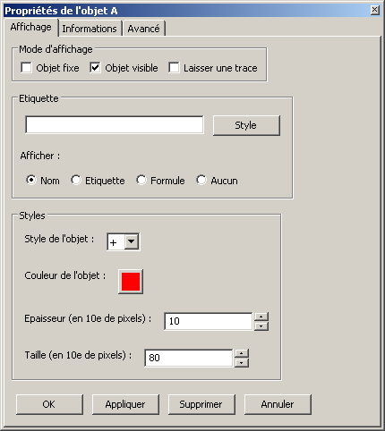

Que signifient ces 4 modes ?

-   Mode « Nom » : le nom de l'objet est affiché.

    Un nom d'objet doit commencer par une lettre (non accentuée), suivie de
    lettres (non accentuées) et de chiffres.
    Il est forcément unique.
    Certains noms sont réservés (*e, pi, x, y, t, i, ...* )

-   Mode « Texte » : un texte est affiché à la place du nom.

    Ce mode permet d'associer n'importe quel type de texte à un objet.
    La syntaxe LATEX est également partiellement supportée, dans ce cas, le texte
    doit être entre $.

    *Exemple :*

    « ``$\alpha_{n}$`` » pour :math:`\alpha_n`

-   Mode « Formule » : le texte affiché est interprété comme une formule.
    On peut aussi mélanger du texte interprété et non interprété, en mettant les
    blocs à interpréter entre { }.

    *Exemple :*

    « ``Le point A a pour abscisse {A.x} et pour ordonnée {A.y}.`` »

-   Mode « Aucun » : rien n'est affiché.

La ligne de commande
--------------------

Elle permet de créer rapidement des objet géométriques. (Personnellement, je
l'utilise fréquemment).

Elle fonctionne dans le module géométrie, dans le module traceur, et dans le
module statistiques.

*Utilisation :*

Voici quelques exemples qui parleront mieux qu'un long discours...

*Exemples*

1.  « ``A = Point(1, 2)`` » ou « ``A = (1, 2)`` »

    Création d'un point A de coordonnées (1 ; 2).

2.  « ``u = Vecteur(1, 2)`` » ou « ``u = (1, 2)`` »

    Création d'un vecteur u de coordonnées (1 ; 2).

3.  « ``AB = Segment(A,B)`` » ou « ``AB = [A B]`` »

    Création du segment [AB].

    *Attention à l'espace entre les lettres dans le deuxième cas.*

4.  « ``d = Droite(A,B)`` » ou « ``d = (A B)`` »

    Création de la droite (AB).

    *Attention à l'espace entre les lettres dans le deuxième cas.*

5.  « ``u = Vecteur(A,B)`` » ou « ``u = A->B`` »

    Création du vecteur :math:`\overrightarrow{AB}`.

6.  « ``M = C + 2*A->B`` »

    Création du point M vérifiant :math:`\overrightarrow{CM}=2\overrightarrow{AB}`.

    *Les parenthèses sont obligatoires.*

7.  « ``fenetre = (-10, 10, -5, 5)`` »

    Changement de la fenetre d'affichage (xmin, xmax, ymin, ymax).

    *Si l'affichage est en mode orthonormé, la fenêtre sera éventuellement élargie pour respecter cette contrainte.*

Les droites, les cercles et les courbes de fonctions peuvent également être créés par la donnée d'une équation.

*Exemple :*

« ``y = 2x + 1`` », « ``y = ln(x)`` », « ``x² - 6x + y² + 2y + 5 = 0`` »

Le traceur de courbes
=====================

Vous pouvez pour l'instant faire les actions suivantes :

-   régler la fenêtre d'affichage
-   orthonormaliser le repère
-   utiliser des objets géométriques
-   représenter des suites

Le traceur de courbes supporte les fonctions définies par morceau, continues ou non.

*Exemples* :

1) Soit la fonction `f`, définie sur `R\\{0}` par ``f(x)=1/x``.

   Remplissez les champs de la manière suivante :

   .. image:: img/inverse.png
       :alt: [V] Y1= [ 1/x ] sur [ R-{0} ]
       :align: center

   *Commentaires* :

   vous remplissez le premier champ avec `1/x` (la fonction), le
   deuxième avec l'intervalle de définition, c'est-à-dire `R-{0}`.

   .. image:: img/inverse_graphe.png
       :alt: Graphe de la fonction inverse.
       :align: center

2) Soit la fonction  `f`, définie sur ``[-2;0[`` par ``f(x) = -1``, et sur ``[0;1[ U ]2;3]`` par ``f(x) = x``.

   Remplissez les champs de la manière suivante :

   .. image:: img/morceaux.png
        :alt: [V] Y2= [ -1|x ] sur [ [-2;0[|[0;1[U]2;3] ]
        :align: center

   *Commentaires* :

   On commence par remplir le 1er champ avec la fonction.

   Comme elle est définie par morceaux, on utilise le symbole « | » comme séparateur : ce qui donne ``-1|x``.

   On remplit ensuite le 2e champ avec l'ensemble de définition.

   Comme elle est définie par morceaux, on utilise là aussi le symbole « | » comme séparateur : ce qui donne ``[-2;0[|[0;1[U]2;3]``.

   .. image:: img/morceaux_graphe.png
        :alt: Graphe d'une fonction affine par morceaux.
        :align: center

.. note::

    Pour changer les propriétés d'une courbe (couleur, style de tracé...), faites un clic droit dessus.

La calculatrice
===============

Son fonctionnement sera assez familier pour quiconque a déjà utilisé une calculatrice scientifique.
Elle permet de travailler sur des nombres réels ou complexes, et de faire du calcul formel de niveau lycée.

En particulier, on peut développer, factoriser, dériver, intégrer, et résoudre des (in)équations ou des systèmes linéaires :

-   developpe((x-3)(x+sin(x)-4))
-   factorise(x*exp(x)+exp(x))
-   derive(x^2+x+1)
-   integre(x^2+x+1)
-   resous(x*exp(x)+exp(x)=0)
-   resous(x+3>2-x ou (x-4<=3x+7 et x>0))
-   resous(x+3-y=2-x et x-4y=3x+7y-1)

.. note:: Pour obtenir le résultat d'un calcul sous forme décimale (calcul
          approché), appuyez sur MAJ+ENTRÉE au lieu de ENTRÉE.

.. note:: On peut faire apparaitre la liste des fonctions par un clic-droit
          dans la zone de saisie, en laissant enfoncée la touche CTRL.

Depuis la version 0.120, elle utilise la librairie de calcul formel sympy *(© 2006-2012 SymPy Development Team)*.

Des variables peuvent être utilisées pour mémoriser des valeurs, ou définir des fonctions.

*Exemples*:

-   ``a = 25+7/4``
-   ``f(x)=2x+17``
-   ``g=f'``

Ici, la fonction `g` est définie comme la dérivée de la fonction `f`.

.. note:: Certaines variables sont protégées (i, e ou E, pi, ...).

.. warning:: Par défaut, le séparateur décimal est la virgule.
             Les différents arguments des fonctions sont séparés par des points-virgules
             (ou une virgule et un espace).

*Exemple*:

    ``normal(1,2 ; 1,7)`` : probabilité que la variable aléatoire X soit comprise
    entre 1,2 et 1,7, lorsque X suit une loi normale N(0;1).

Le module statistiques
======================

Ce module sert essentiellement à tracer des diagrammes, qui n'existent pas
toujours sur tableur, ou qui y sont incorrectement définis.
A l'origine, ma motivation était essentiellement de pouvoir tracer des
histogrammes, qu'OpenOffice.org® ou Excel® confondent avec les diagrammes en
barre.
Il fait aussi la différence entre diagrammes en barres et en bâtons
(contrairement à ce qu'on peut lire souvent, la différence essentielle n'est
pas esthétique).

Voici une présentation des principaux types de graphiques :

Diagrammes en barres :
----------------------

*Utilisés en particulier pour des séries à caractère qualitatif.*

*Exemple :* la répartition des voyelles dans l'alphabet.

On sélectionne le mode :

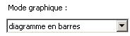

On ajoute les valeurs et les effectifs (ou fréquences) qui leur
correspondent.
La syntaxe est la suivante : « effectif * valeur » (valeur doit être entre
guillemets, pour des valeurs non numériques).

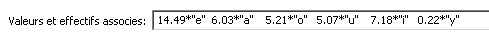

Il ne reste plus qu'à compléter la légende :

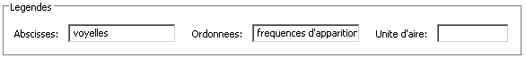

Et à appuyer sur [Entrée] dans un des champs.
Le résultat est le suivant :

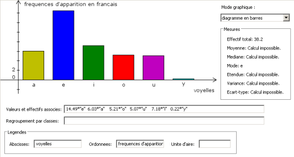

Diagrammes en bâtons :
----------------------

*Utilisés pour des séries à caractère quantitatif discret.*

*Exemple :* la répartition des pointures de chaussures chez les femmes
françaises adultes (2005).

On sélectionne le mode :

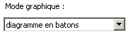

On ajoute les valeurs et les effectifs (ou fréquences) qui leur
correspondent, et on complète la légende :

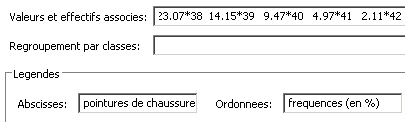

On presse la touche [Entrée] dans un des champs.
Le résultat est le suivant :

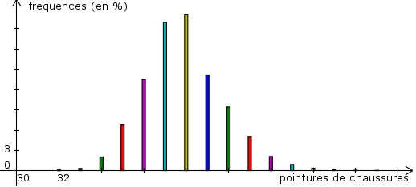

Histogrammes :
--------------

Utilisés pour des séries à caractère quantitatif continu.

On va reprendre l'exemple précédent, en regroupant les pointures par classe.

On sélectionne le mode :

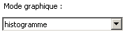

On complète la rubrique « Regroupement par classes ».

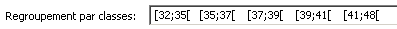

Pour les histogrammes, il n'y a pas d'ordonnée, mais il faut préciser la
nature de l'unité d'aire.

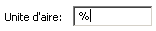

Et on appuye sur [Entrée].

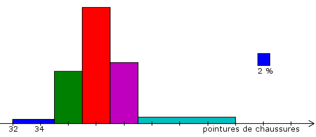

Diagrammes en boites :
----------------------

Également appelés boîtes à moustache.

Il est possible depuis peu d'afficher sur le même axe plusieurs diagrammes en boîtes, pour comparer plusieurs séries.

Il suffit de séparer les séries par des |.

.. image:: img/saisie_donnees_diag_boite.png
   :align: center

Et on appuye sur [Entrée].

.. image:: img/diagrammes_boite.png
   :align: center

.. note:: On peut choisir de faire apparaître ou non les déciles.

Pour aller plus loin :
----------------------

-   A la place des valeurs numériques, on peut tout à fait insérer des formules.

    *Exemple :*

    .. image:: img/stats_avance.png
              :align: center

-   La génération de listes est également possible.

    La syntaxe est celle de Python (cf. `list comprehensions`__ dans la documentation de Python).

    .. __: http://docs.python.org/tutorial/datastructures.html#list-comprehensions

    Essayez par exemple de rentrer cette formule : ``[(rand(),i) for i in range(4)]``.

-   Dans `Outils`, trois sous-menus permettent de créer des expériences aléatoires.

    En particulier, il est possible de simuler des **lancers de dés**, et des **sondages simples**, avec affichage de l'intervalle de confiance.

    Vous pouvez aussi créer votre propre expérience en choisissant `Expérience` dans le menu `Outils`.

    Utilisez alors la fonction ``alea()`` pour créer votre propre variable aléatoire.

    + Sans argument, ``alea()`` renvoie un nombre décimale entre 0 et 1 (distribution uniforme).

    + Avec un argument, ``alea(n)`` renvoie un nombre aléatoire entre 0 et l'entier ``n`` (exclu).

    Entrez la formule correspondant à la variable aléatoire dans le champ « *Experience* », et le nombre d'expériences.

    Par exemple, on peut simuler de la sorte 6 lancers de dés :

    .. image:: img/stats_experience.png
        :align: center

    Éventuellement, entrez aussi les valeurs possibles . Pour un lancer de dé par exemple, cela permet d'afficher en légende 1, 2, 3, 4, 5 et 6, quand bien même aucun « 4 » ne sortirait lors de l'expérience.

.. note::

    Pour simuler des lancers de dés, mieux vaut utiliser le menu spécialement dédié (quelques optimisations y ont été faites).

    La case « lancer une animation » n'a pas d'effet pour l'instant.

.. note::

    Vous pouvez éditer le fichier *experience.py* dans
    *modules/statistiques*/, pour y ajouter de nouvelles fonctions.

Le générateur d'arbres de probabilités
======================================

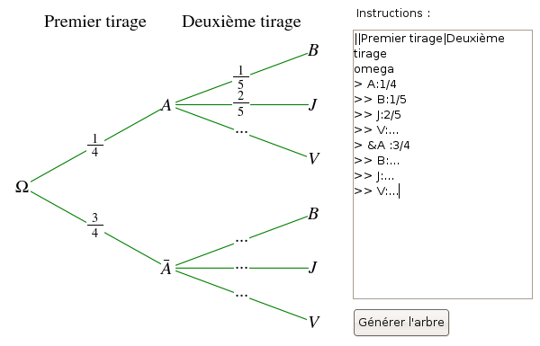

Les arbres de probabilité sont codés de la manière suivante :

-   La première ligne (optionnelle) correspond à la légende.

    *Exemple :*

::

        ||Premier tirage|Deuxième tirage

    *(Note : l'ajout de barres verticales supplémentaires (AltGr+6) décale la légende vers la droite.)*

-   Les lignes suivantes correspondent à l'arbre proprement dit.

-   Le nombre de > correspond au niveau dans l'arbre.
-   La syntaxe est la suivante : « Nom de l'évènement » : « Probabilité de l'évènement »

*Exemple :*

::

    omega
    > A:1/4
    >> B:1/5
    >> J:2/5
    >> V:...
    > &A :3/4
    >> B:...
    >> J:...
    >> V:...

Le **symbole &** indique qu'il s'agit de l'évènement contraire : ``&A`` est ainsi
l'évènement «A barre».

.. note:: la syntaxe LaTeX est également acceptée.

Le générateur de tableaux LaTeX
===============================

Présentation générale
---------------------

Ce module permet de générer des tableaux de signes, tableaux de variations et tableaux de valeurs au format LaTeX.

Pour les tableaux de variations et de signes, dans la majorité des cas, il suffit de donner la fonction et son intervalle de définition.

*Exemple :*

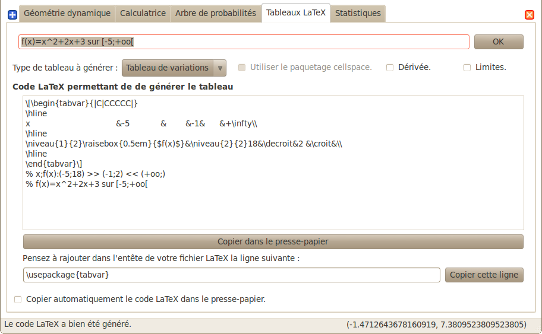

Tableaux de variations
----------------------

Dans la ligne des options, il est possible de choisir si l'on veut afficher ou les limites, ainsi que la ligne comportant le signe de la dérivée.

.. image:: img/tableaux_latex_options.png
    :align: center

Si le logiciel n'arrive pas à déterminer les variations de la fonction, ou si l'on souhaite obtenir un tableau donné, il est possible de spécifier manuellement les variations de la fonction.

*Exemple :*

1. ``f: (-oo;-oo) << (5;8) >> (+oo;0)``

    La fonction `f` a pour limite `-oo` en `-oo`, elle est ensuite croissante jusqu'en 5 (qui a pour image 8), puis décroissante jusqu'en `+oo` (limite `0`).

    *La syntaxe se retient bien si l'on songe à la courbe de `f` : prosaïquement, on peut dire que la courbe commence au « point de coordonnées (-oo;-oo) », qui est plus bas que le « sommet » de coordonnées (5;8), lui-même plus haut que le « point final de coordonnées (+oo;0) ».*

    Résultat avec l'option « dérivée » décochée :

    .. image:: img/tabvar_f.png
        :align: center

2. ``g:(-oo;+oo) >> (2;3;0) >> (4;-oo|+oo) >> (10;0|)``

    La fonction `g` a pour limite `+oo` en `-oo`, elle est ensuite décroissante jusqu'en 2 (qui a pour image 3), avec `g'(2)=0`. Ensuite, elle est de nouveau décroissante jusqu'en 4, qui est une valeur interdite (limite à gauche `-oo`, et limite à droite `+oo`). Enfin, elle est décroissante jusqu'à 10 exclu (limite à gauche `0`).

    .. image:: img/tabvar_g.png
        :align: center

Tableaux de signes
------------------

Dans les options, il est conseillé d'activer le mode `cellspace`, qui permet d'améliorer la gestion par LaTeX des espacement lorsque le tableau contient des fractions.
Il faut bien sûr que le paquet `cellspace` soit installé au préalable.

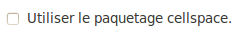

Si le logiciel n'arrive pas à déterminer le signe de la fonction, ou si l'on souhaite obtenir un tableau donné, il est possible de spécifier manuellement le signe de la fonction.

*Exemples :*

1.  On entre l'instruction suivante : « ``x:-pi;pi //  sin(x):-pi -- 0 ++ pi //  !cos(x):-- -pi/2 ++ pi/2 -- // tan(x)`` »

    Les lignes du tableau sont séparées par une double barre oblique : ``//``.

    La première ligne indique la variable et l'ensemble de définition correspondant.

    Les lignes suivantes correspondent aux différents facteurs du produit ou du quotient. (Pour indiquer qu'un facteur se situe au dénominateur, il faut le faire commencer par un point d'exclamation).

    Pour chaque ligne, indiquer le signe (``++`` ou ``--``) puis la valeur pour lequel l'expression s'annule, puis de nouveau le signe, etc.

    La dernière ligne contient le produit ou le quotient lui-même (elle est générée automatiquement si elle est vide).

    Ici, on obtient le tableau suivant :

    .. image:: img/tabsigne_tan.png
         :align: center

    ..note::

2.  « ``x:-2;2 // x+1:-- -1 ++ // !x-1:-- 1 ++`` »

    Tableau correspondant :

    .. image:: img/tabsigne_quotient.png
         :align: center

Il est également possible de rentrer des valeurs symboliques.

*Exemple :*

    « ``f(x): -- x_1 ++ x_2 --`` »

    Ici, :math:`x_1` et :math:`x_2` sont deux valeurs symboliques.

    Tableau correspondant :

    .. image:: img/tabsigne_polynome.png
        :align: center

Par défaut, ces valeurs symboliques sont placées dans l'ordre dans lequel elles apparaissent.

On peut modifier manuellement leur position dans le tableau en leur attributant une valeur numérique.

*Exemple :*

    « ``x:-oo;+oo // f(x): -- 5 ++ // g(x): ++ \alpha=2,1 --``»

    On indique que α vaut environ 2,1 et doit donc être placé après 5.

    Tableau correspondant~:

    ..image:: img/tabsigne_alpha.png
        :align: center

Tableau de valeurs
------------------

Mode automatique
~~~~~~~~~~~~~~~~

Comme pour les tableaux de variations et de signes, il est possible de générer
automatiquement le tableau de valeur, en rentrant la fonction, l'intervalle et
éventuellement le pas (1 par défaut).

*Exemple* :

En saisissant ``f(x)=x^2 sur [-3;3] pas 0,5``, on obtient~:

    .. image:: img/tabvalx2.png
         :align: center

Mode « expert »
~~~~~~~~~~~~~~~

Pour obtenir un tableau de valeur plus personnalisé, il faut utiliser la syntaxe avancée.

Il faut saisir la fonction, les antécédents (séparés par des points-virgules), et (éventuellement) la précision souhaitée.

La syntaxe est la suivante : *fonction: valeur1 ; valeur2 ; valeur3 ; ...* ou encore *fonction: [precision]: valeur1 ; valeur2 ; valeur3 ; ...*

Au lieu d'entrer les valeurs une par une, il est possible de saisir une plage de valeurs. Par exemple ``2,3..8`` donne tous les entiers de 2 à 8, et ``1,1.1..1.9`` est équivalent à ``1 ; 1.1 ; 1.2 ; 1.3 ; 1.4 ; 1.5 ; 1.6 ; 1.7 ; 1.8 ; 1.9``.

Des plages ou valeurs isolées successives doivent être séparées par un point-virgule.

On peut éventuellement étaler le tableau sur plusieurs lignes, avec un double slash ``//`` pour séparer les lignes.

*Exemples :*

1. Tableau de valeur d'une fonction de référence : « ``sin(x): -5,-4.9..-4`` ».

   Le résultat est le suivant :

   .. image:: img/tabval_sin.png
        :align: center

2. Exemple d'un tableau coupé en deux : « ``h(x)=sin(x)+1: [0.01]: -5,-4.5..0 // 0,1..3 ; 4 ; 6`` »

   Le résultat est le suivant :

   .. image:: img/tabval_h.png
        :align: center

===================
Utilisation avancée
===================

Le fichier param.py
===================

Un grand nombre de paramètres peuvent être modifiés dans le fichier
*param.py* avec un simple éditeur de textes.

*Exemple :*

Remplacez « ``affiche_axes = True`` » par « ``affiche_axes = False`` » pour que les axes
ne soient plus affichés par défaut.

Note : il peut être parfois nécessaire d'effacer le dossier */preferences*
(qui contient les paramètres de la session précédente) pour que les
changements soient pris en compte.

Débogage
========

Dans le menu *Avancé>Déboguer*, sélectionner « *Déboguer* » pour faire apparaître
une fenêtre contenant entre autres tous les rapports d'erreurs.

Par ailleurs,
le répertoire */log* contient les fichiers .log générés lors de la dernière
exécution (actions effectuées, messages d'erreurs, etc.)

La ligne de commande
====================

*Introduction:*

La ligne de commande sert essentiellement à débuguer le programme.
(Ou à réaliser certaines opérations internes, etc...)
La ligne de commande permet d'exécuter des instructions Python.

Précédé du symbole **&**, le résultat de la commande sera affiché dans la
console.

(*NB* : assurez-vous au prélable que l'option « Déboguer » soit
cochée, dans le menu Avancé>Déboguer).

Les raccourcis suivants sont disponibles :

-   ``!p.`` pour  ``panel.``
-   ``!c.`` pour ``canvas.``
-   ``!f.`` pour ``feuille.``
-   ``!o.`` pour ``objets.``
-   ``!g.`` pour ``moteur_graphique.``
-   ``exit`` pour quitter le logiciel
-   ``restart`` ou ``!!!`` pour redémarrer le logiciel

Leur maniement nécessite évidemment de bien connaître l'API de Géophar,
et donc de faire un tour dans le code source.

La commande de redémarrage est utile pour tester rapidement une modification du
code source.

**Exemples :**

1) « ``print 'hello world !'`` »

   Ceci va afficher 'hello wold !' sur la console.

   *NB :* « ``& 'hello world !'`` » produirait le même resultat.

2) « ``print objets.A`` »

   Affiche, s'il existe, l'objet A dans la console.

   *NB :* Cette commande s'abrège de même en « ``& !o.A`` ».

3) « ``.exporter('test.png')`` »

   Exporte la figure courante en un fichier *test.png*.

   *NB :* Forme abrégée : « ``!p.exporter('test.png')`` ».

4) « ``feuille.fenetre = (-5,2,-7,3)`` »

   Change la fenêtre d'affichage en (-5, 2, -7, 3).

   *NB :* Forme abrégée : « ``!f.fenetre = (-5,2,-7,3)`` ».

====================
Comment contribuer ?
====================

**Vous pouvez par exemple :**

-   m'envoyer un mail à l'adresse suivante :
    `wxgeo@users.sourceforge.net`_, en me donnant vos impressions générales.

-   corriger les éventuelles fautes d'orthographe.

-   me signaler les bugs existants sur le tracker__ (pas besoin de s'inscrire).

    .. __: http://wxgeo.free.fr/tracker

-   me proposer des corrections de bugs :)

-   ajouter des fonctions mathématiques à la calculatrice

-   implémenter la gestion des coniques

-   **compléter cette documentation ou créer un tutoriel** (je manque de
    temps pour tout faire !).

    N'hésitez pas à compléter le wiki__.

    .. __: http://www.maths.ac-aix-marseille.fr/webphp/wiki/index.php/Accueil#Aide_WxG.C3.A9om.C3.A9trie.2FG.C3.A9ophar

Je suis également ouvert à toute autre contribution, et j'ai toujours plaisir à travailler en équipe... :-)

Une liste plus complète de suggestions est disponible sur le wiki__.

.. __: http://www.maths.ac-aix-marseille.fr/webphp/wiki/index.php/FAQ

**Je recherche en particulier (liste non exhaustive) :**

1.  des personnes pour m'aider à maintenir et à améliorer :

    -   le fonctionnement sous Linux :

        + retours d'expérience
        + maintenance du paquet .deb existant
        + création de paquets .rpm
        + guides utilisateurs, etc.

    -   le fonctionnement sous MacOs X (je n'ai pas de Mac)

        + retours d'expérience
        + tutoriels
        + aides à l'installation

        Jean-Pierre Garcia a commencé un travail en ce sens.

2.  des personnes intéressées par la construction de nouveaux modules
    pour WxGéométrie/Géophar.

    Je pense en particulier à des professeurs de mathématiques qui auraient des
    compétences en programmation objet (mais pas nécessairement en Python :
    Python en lui-même s'apprend très rapidement si l'on a déjà l'habitude
    de programmer).

3.  des personnes pour me faire remonter des rapports de bugs, ou des
    suggestions. Toutes les critiques suffisamment précises sont bonnes à
    prendre. ;-)

4.  une ou des personnes pour améliorer le **site internet** de WxGéométrie/Géophar

=============
Remerciements
=============

Sans prétention d'exhaustivité, je voudrais remercier :

-   **Boris Mauricette**, pour avoir contribué au module de Statistiques
    (tracé des quartiles), et à l'interpolation polynomiale.
-   **Christophe Gragnic**, qui a converti toute la documentation au format
    ReStructuredText.
-   **Christophe Bal** pour ses commentaires, et pour avoir proposé la
    syntaxe du module de Probabilités.
-   **Jean-Pierre Garcia** pour avoir écrit un guide d'installation pour MacOs X.
-   **Les développeurs de sympy**, avec qui j'ai toujours eu des échanges
    cordiaux et constructifs, y compris de code.

Remerciements plus particuliers à **Chris Smith**, **Vinzent Steinberg** et **Aaron Meurer**.

-   **Christophe Vrignaud**, qui a développé et maintenu quelques temps le
    module Scicalc pour WxGéométrie.
-   **Stéphane Clément** a mis a disposition de WxGéométrie puis de Géophar
    le wiki de l'académie d'Aix-Marseille.
-   Tous ceux qui ont pris le temps de faire quelques commentaires sur ce
    programme, et m'ont encouragé à continuer (en particulier dans les
    premiers temps : mon frère Thomas, Enzo, Rhydwen Volsik, Robert
    Setif...).
-   **François Lermigeaux**, pour les coups de pub occasionnels.
-   **Georges Khaznadar**, pour ses nombreux conseils concernant Debian.
-   Tous ceux qui ont pris le temps de faire des rapports de bugs et des
    retours.

*Merci enfin à Sophie pour sa patience !*

.. _wxgeo@users.sourceforge.net: mailto:wxgeo@users.sourceforge.net
