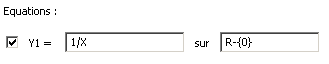
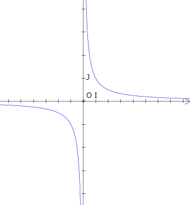
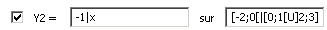
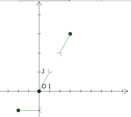
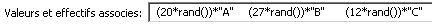
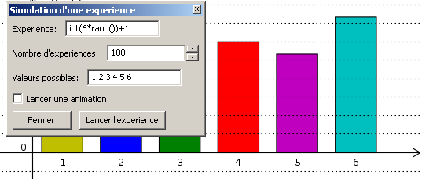

***********
Généralités
***********

.. image:: img/logo.png
    :alt: WxGéométrie

Dynamic geometry, graph plotter, and more for french mathematic teachers.
*Copyright © 2005-2011 Nicolas Pourcelot*

**http://wxgeo.free.fr**

=======
Licence
=======

This program is free software; you can redistribute it and/or modify it under
the terms of the GNU General Public License as published by the Free Software
Foundation; either version 2 of the License, or (at your option) any later
version.
This program is distributed in the hope that it will be useful, but WITHOUT
ANY WARRANTY; without even the implied warranty of MERCHANTABILITY or FITNESS
FOR A PARTICULAR PURPOSE. See the GNU General Public License for more
details.
You should have received a copy of the GNU General Public License along with
this program; if not, write to the Free Software Foundation, Inc., 51
Franklin St, Fifth Floor, Boston, MA 02110-1301

Ce programme est un logiciel libre; vous pouvez le redistribuer et/ou le
modifier selon les termes de la GNU General Public Licence telle qu'elle a
été publiée par la Free Software Foundation; soit la version 2 de la licence,
ou (au choix) toute version ultérieure.
Ce programme est distribué dans l'espoir qu'il puisse être utile, mais sans
aucune garantie, pas même la garantie implicite qu'il puisse etre adapté à un
usage donné. Pour plus de précisions, lisez la GNU General Public License.
Vous avez recu en principe une copie de la GNU General Public License en même
temps que ce programme. Si ce n'est pas le cas, écrivez a l'adresse suivante
: Free Software Foundation, Inc., 51 Franklin St, Fifth Floor, Boston, MA
02110-1301

============
Installation
============

Pour fonctionner, ce programme nécessite la configuration logicielle suivante:

-   Windows 98 ou supérieur, ou une distribution Linux assez récente.
-   Le logiciel Python, version 2.4 ou supérieure.
    (Logiciel libre, disponible gratuitement sur *http://www.python.org*)
    Sous Linux, une version récente est en principe déjà présente.
-   La librairie graphique WxPython, version 2.6 (des problèmes
    subsistent avec la version 2.8 sous Windows).
    (Logiciel libre, disponible gratuitement sur *http://www.wxpython.org*)
    Sous Linux, une version est en principe deja présente, mais elle n'est pas
    toujours assez récente.
-   La librairie mathématique numpy
    (Logiciel libre, disponible gratuitement sur *http://sourceforge.net/project/
    showfiles.php?group_id=1369&package_id=175103*)
-   La librairie mathématique Matplotlib, version 0.91.2 ou supérieure
    (Logiciel libre, disponible gratuitement sur
    *http://www.sourceforge.net/projects/matplotlib*)

*Remarque* : ces logiciels doivent être installés dans l'ordre mentionné.

Sous Windows, un redémarrage du système est conseillé après ces
installations.

Après avoir téléchargé la dernière version de WxGeometrie
(*http://www.sourceforge.net/projects/wxgeometrie*), dézippez l'archive dans
un répertoire sur lequel vous avez les permissions nécessaires.
Vous pouvez lancer le programme en double-cliquant sur le fichier
*wxgeometrie.pyw* .

*Sous Windows :*
Il existe désormais un programme d'installation de WxGéométrie.
Ce programme nécessite un accès à internet, car il télécharge les dernières
versions de Python, et des autres librairies nécessaires (afin de ne pas
alourdir inutilement le programme d'installation en incluant systématiquement
tout).

Pour **désinstaller** WxGéométrie, il suffit de supprimer le répertoire
d'installation du programme. En effet, pour l'instant, WxGéométrie n'écrit
rien dans la base de registre.

Il existe également une version sans installation, qui ne nécessite pas la
présence de Python.
Cette dernière version est surtout livrée à des fins de démonstration (ou
pour être utilisée sur une clef USB, style Framakey) ; elle est  probablement
moins stable (si quelqu'un veut reprendre et améliorer le projet ?).

============
Premiers pas
============

Certaines options de WxGéométrie ne sont pas encore fonctionnelles.
Il ne s'agit pas de bugs en general, mais, simplement, du fait que ces
options ne sont pas encore complètement écrites. Ainsi, un certain nombre de
boutons et d'entrées du menu ne provoquent aucune action dans les versions
actuelles. Ceci correspond à des fonctionnalités qui seront implementées dans
les prochaines versions.

WxGéométrie est composée de plusieurs modules ; les 5 principaux sont :

-   Un module de géométrie dynamique.
-   Un traceur de courbes.
-   Une calculatrice formelle.
-   Un module graphique de statistiques.
-   Un générateur d'arbres de probabilités.

Les autres modules présents sont fournis à titre purement expérimental, et ne
sont donc pas documentés ici.

*Note :*
Toutes les fonctionnalités du module de géométrie dynamique sont utilisables
dans le traceur de courbes ; elles sont aussi (en partie) utilisables dans le
module de statistiques.

Le module de géométrie dynamique
================================

Pilotage avec la souris
-----------------------

Vous pouvez pour l'instant faire les actions suivantes :

-   créer une nouvelle feuille
-   créer différents types de points, de droites, de cercles, des
    vecteurs, des intersections...
-   modifier les propriétés de ces différents objets (changer leur
    couleur, les masquer...)
-   régler la fenêtre d'affichage
-   orthonormaliser le repère
-   annuler une ou plusieurs actions
-   exporter et sauvegarder la figure

Utilisation de la souris pour piloter le logiciel :

-   Laissez enfoncé le bouton droit de la souris pour déplacer la figure.
-   La molette de la souris permet de zoomer sur la figure.
-   En laissant enfoncée la touche [Ctrl], la molette de la souris permet
    d'ajuster la taille des textes de la figure.
-   Laissez enfoncée la touche [Ctrl], et le bouton gauche de la souris,
    pour sélectionner une zone et zoomer dessus.
-   Vous pouvez déplacer les points libres de la figure avec la souris.
-   Placez-vous sur un point, ou un texte, et appuyez sur la touche
    [Entrée], pour le renommer.
-   Placez-vous sur un objet, et faites un clic droit pour éditer ses
    propriétés
-   Placez-vous sur un objet, et faites [Suppr] pour le supprimer, ou
    [Maj] + [Suppr] pour le masquer .
-   Si vous créez un point libre en laissant la touche [Maj] enfoncée, le
    point se placera sur le quadrillage.
-   Vous pouvez déplacer le nom d'un point autour de celui-ci en cliquant
    dessus, la touche [Alt] étant enfoncée.

Note:

Sous Ubuntu, la touche [Alt] est déjà utilisée pour déplacer la fenêtre. Il
est conseillé de modifier ce comportement : dans Système>Préférence>Fenêtres,
choisir "Super" comme "touche de mouvement".

Création d'objets via le menu «Créer»
-------------------------------------

Pour la création des objets géométriques, il existe une abondante aide
contextuelle dans chaque fenêtre de création d'objet.
Cliquez sur le point d'interrogation en haut de la fenêtre, puis sur un
champ, pour obtenir une aide detaillée.
En cliquant avec le bouton du milieu de la souris dans un champ, vous ferez
également apparaitre diverses propositions.

Vous pouvez utiliser les notations suivantes : [A B] pour le segment [AB], (A
B) pour la droite (AB), (A>B) pour le vecteur A->B, ||A>B|| pour sa norme.
*Remarquez l'espace entre les lettres "A" et "B" dans les deux premiers cas.*

Choisir le mode d'affichage de l'étiquette d'un objet
-----------------------------------------------------

Vous remarquerez que chaque objet possède quatre modes d'affichage : nom,
texte, formule, ou aucun.

.. image:: img/ptes_objets.png
    :alt: "Fenêtre de propriété"

Que signifient ces 4 modes ?

-   Mode « Nom » : le nom de l'objet est affiché.

Un nom d'objet doit commencer par une lettre (non accentuée), suivie de
lettres (non accentuées) et de chiffres.
Il est forcément unique.
Certains noms sont réservés (*e, pi, x, y, t, i, ...* )

-   Mode « Texte » : un texte est affiché à la place du nom.

Ce mode permet d'associer n'importe quel type de texte à un objet.
La syntaxe LATEX est également partiellement supportée, dans ce cas, le texte
doit être entre $.
*Exemple :*
"$\alpha_{n}$"
-   Mode « Formule » : le texte affiché est interprété comme une formule.
On peut aussi mélanger du texte interprété et non interprété, en mettant les
blocs à interpréter entre { }.
*Exemple :*
"Le point A a pour abscisse {A.x} et pour ordonnée {A.y}."

-   Mode « Aucun » : rien n'est affiché.

La ligne de commande
--------------------

Elle permet de créer rapidement des objet géométriques. (Personnellement, je
l'utilise fréquemment).
Elle fonctionne dans le module géometrie, dans le module traceur, et dans le
module statistiques.

*Utilisation :*
Voici quelques exemples qui parleront mieux qu'un long discours...

*Exemples*

1.  "A=Point(1,2)" ou "A=(1,2)"
Création d'un point A de coordonnées (1 ; 2).

2.  "u=Vecteur(1,2)" ou "u=(1,2)"
Création d'un vecteur u de coordonnées (1 ; 2).

3.  "AB=Segment(A,B)" ou "AB=[A B]"
Création du segment [AB].
*Attention à l'espace entre les lettres dans le deuxième cas.*
4.  "d=Droite(A,B)" ou "d=(A B)"
Création de la droite (AB).
*Attention à l'espace entre les lettres dans le deuxième cas.*
5.  "u=Vecteur(A,B)" ou "u=A>B"
Création du vecteur A->B.
6.  "M=C+2*(A>B)"
Création du point M vérifiant C->M = 2 A->B.
*Les parenthèses sont obligatoires.*
7.  "fenetre=(-10,10,-5,5)"
Changement de la fenetre d'affichage (xmin, xmax, ymin, ymax).
*Si l'affichage est en mode orthonormé, la fenêtre sera élargie pour
respecter cette contrainte.*

Le traceur de courbes
=====================

Vous pouvez pour l'instant faire les actions suivantes :

-   régler la fenêtre d'affichage
-   orthonormaliser le repère
-   utiliser des objets géométriques
-   représenter des suites

Le traceur de courbes supporte les fonctions définies par morceau, continues
ou non.

*Exemples* :

1) Soit la fonction *f*, définie sur R-{0} par *f*(*x*)=1/*x*
Remplissez les champs de la manière suivante :

*Notes* : vous remplissez le premier champ avec 1/x (la fonction), le
deuxième avec l'intervalle de définition, c'est-à-dire R-{0}.

2) Soit la fonction  *f*, définie sur [-2;0[ par *f*(*x*) = -1, et sur
    [0;1[ U ]2;3] par *f*(*x*) = *x*

Remplissez les champs de la manière suivante :

*Notes* : Vous remplissez le premier champ avec la fonction.
Comme elle est définie par morceaux, on utilise le symbole "|" comme
séparateur: ce qui donne -1|x.
Vous remplissez le 2ème champ avec l'intervalle de définition.
Comme elle est définie par morceaux, on utilise le symbole "|" comme
séparateur: ce qui donne `[-2;0[|[0;1[U]2;3]`.

La calculatrice
===============

Son fonctionnement sera assez familier pour quiconque a déjà utilisé une
calculatrice scientifique.
Elle permet de travailler sur des nombres réels ou complexes, et de faire du
calcul formel de niveau lycée.

En particulier, on peut développer, factoriser, dériver, intégrer, et
résoudre des (in)équations ou des systèmes linéaires :

-   developpe((x-3)(x+sin(x)-4))
-   factorise(x*exp(x)+exp(x))
-   derive(x^2+x+1)
-   integre(x^2+x+1)
-   resous(x*exp(x)+exp(x)=0)
-   resous(x+3>2-x ou (x-4<=3x+7 et x>0))
-   resous(x+3-y=2-x et x-4y=3x+7y-1)

*Nota 1* : Pour obtenir le résultat d'un calcul sous forme décimale (calcul
approché), appuyez sur MAJ+ENTRÉE au lieu de ENTRÉE.
*Nota 2* : On peut faire apparaitre la liste des fonctions par un clic-droit
dans la zone de saisie, en laissant enoncée la touche CTRL.

Depuis la version 0.120, elle utilise la librairie de calcul formel sympy *(©
2006-2011 SymPy Development Team)*.

Des variables peuvent être utilisées pour mémoriser des valeurs, ou définir
des fonctions.

*Exemples*:

-   a = 25+7/4
-   f(x)=2x+17
-   g=f'

Ici, la fonction g est définie comme la dérivée de la fonction f.

Notez que certaines variables sont protégées (i, e ou E, pi, ...).

Le module statistiques
======================

Ce module sert essentiellement à tracer des diagrammes, qui n'existent pas
toujours sur tableur, ou qui y sont incorrectement définis.
A l'origine, ma motivation était essentiellement de pouvoir tracer des
histogrammes, qu'OpenOffice.org® ou Excel® confondent avec les diagrammes en
barre.
Il fait aussi la différence entre diagrammes en barres et en bâtons
(contrairement à ce qu'on peut lire souvent, la différence essentielle n'est
pas esthétique).

Voici une présentation des principaux types de graphiques :

***Diagrammes en barres :**
*Utilisés en particulier pour des séries à caractère qualitatif.
*Exemple :* la répartition des voyelles dans l'alphabet.

On sélectionne le mode :
.. image:: img/diag_barres0.png

On ajoute les valeurs et les effectifs (ou fréquences) qui leur
correspondent.
La syntaxe est la suivante : « effectif * valeur » (valeur doit être entre
guillemets, pour des valeurs non numériques).

.. image:: img/diag_barres1.png

Il ne reste plus qu'à compléter la légende :

.. image:: img/diag_barres2.png

Et à appuyer sur [Entrée] dans un des champs.
Le résultat est le suivant :

.. image:: img/diag_barres.png

**Diagrammes en bâtons :**
*Utilisés pour des séries à caractère quantitatif discret.
*Exemple :* la répartition des pointures de chaussures chez les femmes
françaises adultes (2005).

On sélectionne le mode :
.. image:: img/diag_baton_0.png

On ajoute les valeurs et les effectifs (ou fréquences) qui leur
correspondent, et on complète la légende :
.. image:: img/diag_baton_1.png

On presse la touche [Entrée] dans un des champs.
Le résultat est le suivant :

.. image:: img/diag_baton_2.png

*

**Histogrammes :**

Utilisés pour des séries à caractère quantitatif continu.
On va reprendre l'exemple précédent, en regroupant les pointures par classe.

On sélectionne le mode :
.. image:: img/histo_0.png

On complète la rubrique « Regroupement par classes ».
.. image:: img/histo_1.png

Pour les histogrammes, il n'y a pas d'ordonnée, mais il faut préciser la
nature de l'unité d'aire.
.. image:: img/histo_2.png

Et on appuye sur [Entrée].
.. image:: img/histo_3.png

**Pour aller plus loin**

-   A la place des valeurs numériques, on peut tout à fait insérer des
    formules.

*Exemple*

-   La génération de listes est également possible. La syntaxe est celle
    de Python (cf. *list comprehensions* dans la documentation de Python).

Essayez par exemple de rentrer cette formule : [(rand(),i) for i in
range(4)].

-   Dans Outils, trois sous-menus permettent respectivement de créer des
    expériences.

En particulier, à titre d'exemple, il est possible de simuler des** lancers
de dés**, et des **sondages simples**.

N'hésitez pas à éditer le fichier *experience.py* dans
*modules/statistiques*/, et à y ajouter de nouvelles fonctions.
Vous pourrez ensuite réaliser vos propres expériences, depuis le menu «
Experience ».

Entrez votre formule dans le champ « Experience » (ici, un lancer de dé), et
le nombre d'expériences.
Eventuellement, entrez aussi les valeurs possibles . Pour un lancer de dé par
exemple, cela permet d'afficher en légende 1, 2, 3, 4, 5 et 6,
quand bien même il n'y aurait aucun « 4 » par exemple.

*Notes :*
- Pour simuler des lancers de dés, mieux vaut utiliser le menu spécialement
dédié (quelques optimisations y ont été faites).
- La case « lancer une animation » n'a pas d'effet pour l'instant.

Le générateur d'arbres de probabilités
======================================

.. image:: img/arbre.png

Les arbres de probabilité sont codés de la manière suivante :

-   La première ligne (optionnelle) correspond à la légende.

*Exemple :*
||Premier tirage|Deuxième tirage

*(Note : l'ajout de barres verticales supplémentaires (AltGr+6) décale la
légende vers la droite.)*

-   Les lignes suivantes correspondent à l'arbre proprement dit.

-   Le nombre de > correspond au niveau dans l'arbre.
-   La syntaxe est la suivante : « Nom de l'évènement » : « Probabilité de l'évènement »

*Exemple :*

omega
> A:1/4
>> B:1/5
>> J:2/5
>> V:...
> &A :3/4
>> B:...
>> J:...
>> V:...

Le **symbole &** indique qu'il s'agit de l'évènement contraire : &A est ainsi
l'évènement «A barre».
*(Note : la syntaxe LaTeX est également acceptée).*

===================
Utilisation avancée
===================

Le fichier param.py
===================

Un grand nombre de paramètres peuvent être modifiés dans le fichier
*param.py* avec un simple éditeur de textes.

*Exemple*

Remplacez "affiche_axes = True" par "affiche_axes = False" pour que les axes
ne soient plus affichés par defaut.

Note : il peut être parfois nécessaire d'effacer le dossier */preferences*
(qui contient les paramètres de la session précédente) pour que les
changements soient pris en compte.

Débogage
========

Dans le menu Avancé>Déboguer, sélectionner « Déboguer » pour faire apparaître
une fenêtre contenant entre autres tous les rapports d'erreurs. Par ailleurs,
le répertoire */log* contient les fichiers .log générés lors de la dernière
exécution (actions effectuées, messages d'erreurs, etc.)

La ligne de commande
====================

*Introduction:*
La ligne de commande sert essentiellement à débuguer le programme.
(Ou à réaliser certaines opérations internes, etc...)
La ligne de commande permet d'exécuter des instructions Python.

Précédé du symbole **&**, le résultat de la commande sera affiché dans la
console. (*NB* : assurez-vous au prélable que l'option « Déboguer » soit
cochée, dans le menu Avancé>Déboguer).

Les raccourcis suivants sont disponibles :

-   *!p.* pour *panel.*
-   *!c.* pour *canvas.*
-   *!f.* pour *feuille.*
-   *!o.* pour *objets.*
-   *!g.* pour *moteur_graphique.*

Leur maniement nécessite évidemment de bien connaître l'API de WxGéométrie,
et donc de faire un tour dans le code source.

*Exemples :*
1) "print 'hello world !'"
Ceci va afficher 'hello wold !' sur la console.
*NB :* « & 'hello world !' » produirait le même resultat.
2) "print objets.A"
Affiche, s'il existe, l'objet A dans la console.
*NB :* Cette commande s'abrège de même en « & !o.A ».
3) "panel.exporter('test.png')"
Exporte la figure courante en un fichier *test.png*.
*NB :* Forme abrégée : « !p.exporter('test.png') ».
4) "feuille.fenetre = (-5,2,-7,3)"
Change la fenêtre d'affichage en (-5, 2, -7, 3).
*NB :* Forme abrégée : « !f.fenetre = (-5,2,-7,3) ».

====================
Comment contribuer ?
====================

**Vous pouvez par exemple :**

-   m'envoyer un mail à l'adresse suivante :
    `wxgeo@users.sourceforge.net`_, en me donnant vos impressions générales.
-   corriger les éventuelles fautes d'orthographe.
-   me signaler des bugs existants, et non répertoriés sur le tracker
    *http://wxgeo.free.fr/tracker* .
-   me proposer des corrections de bug :)
-   ajouter des fonctions mathématiques à la calculatrice
-   implémenter la gestion des coniques
-   commencer de géométrie dynamique dans l'espace
-   compléter cette documentation ou créer un tutoriel (je manque de
    temps pour tout faire !)

Je suis également ouvert à toute autre contribution, et je suis prêt à
travailler en équipe... :-)

**Je recherche en particulier (liste non exhaustive) :**

1.  des personnes pour m'aider à maintenir et à améliorer :

    -   le fonctionnement sous Linux :

tests, création de scripts bash d'installation, de paquetages .deb ou .rpm,
guides utilisateurs, etc..., chose que je n'ai pas le temps de faire aussi
bien que je le souhaiterais.

    -   le fonctionnement sous MacOs X :

théoriquement, ça devrait tourner assez facilement,  mais je n'ai jamais eu
la possibilité de le tester.

2.  des personnes intéressées par la construction de nouveaux modules
    pour WxGéométrie.

Je pense en particulier à des professeurs de mathématiques, de sciences-
physiques, de technologie... qui auraient un peu d'expérience en
programmation objet (mais pas nécessairement en python : python en lui-même
s'apprend en une semaine).
Une première expérience fructueuse a déjà commencée, en collaboration avec
Christophe Vrignaud.

3.  des personnes pour me faire remonter des rapports de bugs, ou des
    suggestions. A quelques exceptions près, les seuls échos que j'ai pu
    avoir, ce sont les statistiques de sourceforge. Je sais que le projet
    manque encore de maturité, mais au fil des versions, il y a désormais un
    peu de matière. Toutes les critiques sufisamment précises sont bonnes à
    prendre. ;-)

Note :*  une documentation spécifique pour développeurs se trouve dans le
répertoire *doc/developpeurs/*.

=============
Remerciements
=============

Sans prétention d'exhaustivité, je voudrais remercier :

-   Boris Mauricette, pour avoir contribué au module de Statistiques
    (tracé des quartiles).
-   Christophe Bal pour ses commentaires, et pour avoir proposé la
    syntaxe du module de Probabilités.
-   Les développeurs de sympy, avec qui j'ai toujours eu des échanges
    cordiaux et constructifs, y compris de code.

Remerciements plus particuliers à Chris Smith, Vinzent Steinberg et Aaron
Meurer.

-   Christophe Vrignaud, qui a développé et maintenu quelques temps le
    module Scicalc pour Wxgéométrie.
-   Stéphane Clément a mis a disposition de Wxgéométrie le wiki de
    l'académie d'Aix-Marseille.
-   Tous ceux qui ont pris le temps de faire quelques commentaires sur ce
    programme, et m'ont encouragé à continuer (en particulier dans les
    premiers temps : mon frère Thomas, Enzo, Rhydwen Volsik, Robert
    Setif...).
-   François Lermigeaux, pour les coups de pub occasionnels.
-   Georges Khaznadar, pour ses nombreux conseils concernant Debian.
-   Tous ceux qui ont pris le temps de faire des rapports de bugs et des
    retours.

Merci enfin à Sophie pour sa patience !

.. _wxgeo@users.sourceforge.net: mailto:wxgeo@users.sourceforge.net
